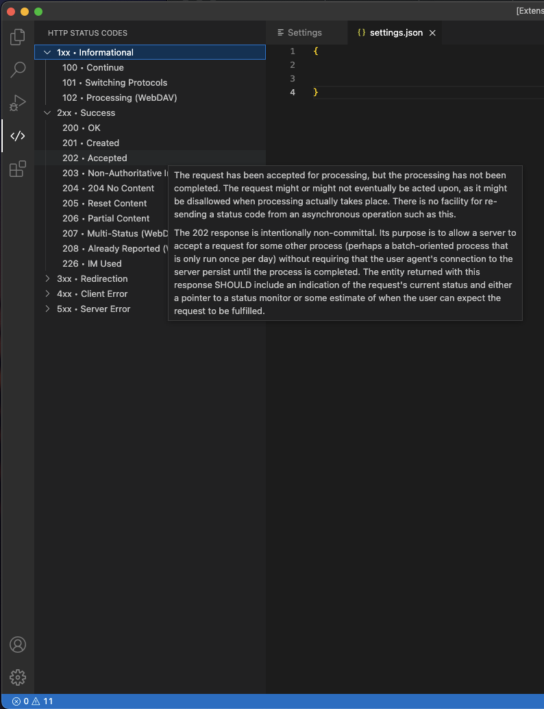

# HTTP Status Codes

<!-- project badges -->

## Overview
This small extension gives you an overview of the available status codes in the VS Code Tree View.

Source: https://www.restapitutorial.com/httpstatuscodes.html#

## Attributions
- Icon: [Http icons created by Freepik - Flaticon](https://www.flaticon.com/free-icons/http)